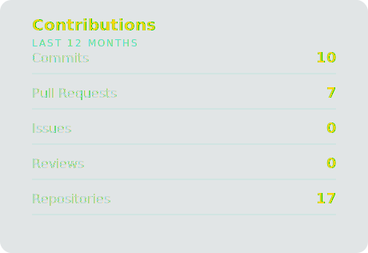

  

  
  &nbsp;
  

 

<h3 align="center">Tech Stack</h3>

  

  Framer Motion · Radix UI · Zod · pandas · NumPy · OpenCV · Matplotlib · Jupyter

 

<h3 align="center">Contributions</h3>

  

 

  

